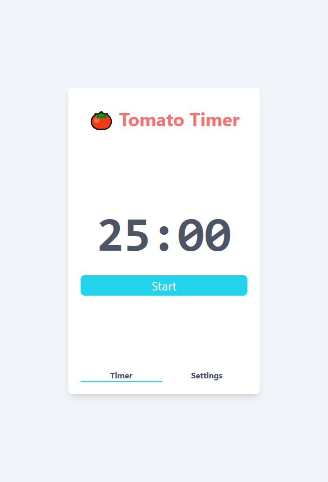
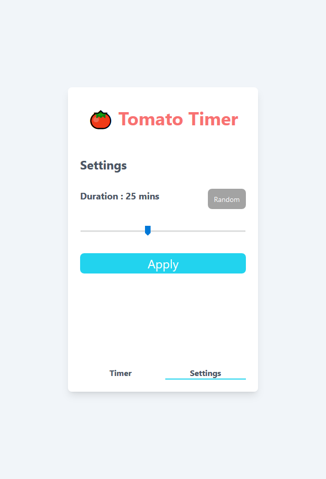
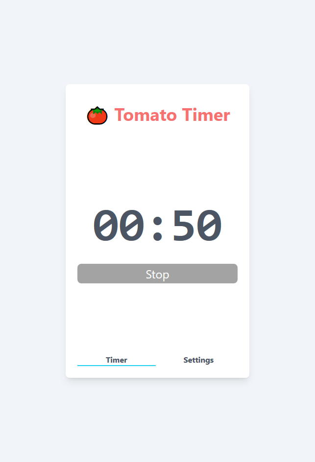
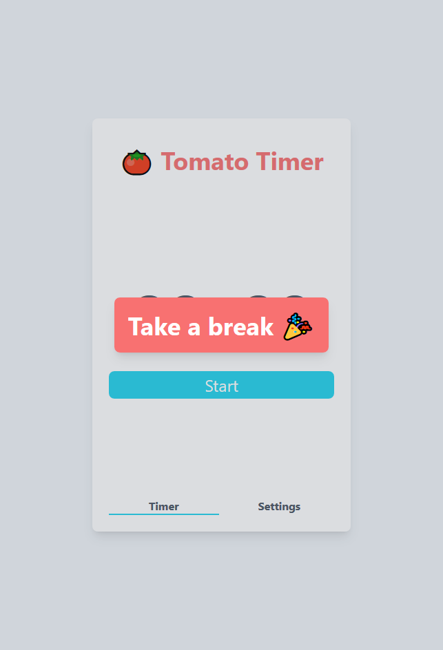

# Tomato Timer in Angular

The purpose of this project is demonstrate how Angular supports some key features in web frontend application.

- data binding
- form handling
- routing
- custom component
- fetch external data
- reaction to data change
- client side state
- component styling
- lazy loading

You can compare the same application features implemented with [React](https://github.com/wilsonleung/timer-react)

## To run the application

In the project directory, you can run:

1. `npm install`
2. `ng serve`

Navigate to `http://localhost:4200/`. The app will automatically reload if you change any of the source files.
